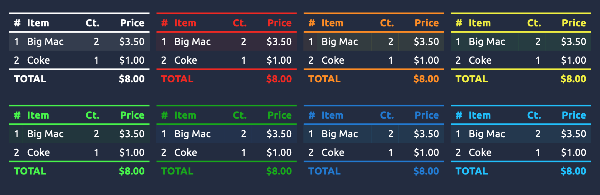

# powerpoint-custom-table-style-generator

Allows you to create custom style file for your PowerPoint tables. It will generate custom styles for your text and accent colors. For instance:



## Installation

You need to install [gomplate](https://docs.gomplate.ca/). On MacOS you can install it using brew:
````
brew install gomplate
````

## Execution

In Google Chrome, install the [OOXML Tools](https://chrome.google.com/webstore/detail/ooxml-tools/bjmmjfdegplhkefakjkccocjanekbapn) extension. Drop your PPTX file, and open `ppt/tableStyles.xml`.

In a Terminal run `./render.sh` to get help on available options. To run the program on the default template, use:
````
./render.sh template.xml
````

The result is stored in your clipboard. You can paste it to replace the contents of `tableStyles.xml`. You will need to manually delete the final empty line after pasting.

## Background information

Everything about creating custom table styles by hacking the PowerPoint XML can be found on John Korchok site:

- [XML Hacking: An Introduction](http://www.brandwares.com/bestpractices/2015/02/xml-hacking-an-introduction/)
- [XML Hacking: Editing in OS X](http://www.brandwares.com/bestpractices/2015/11/xml-hacking-editing-in-os-x/)
- [Part 1: Custom Table Styles](http://www.brandwares.com/bestpractices/2015/07/xml-hacking-custom-table-styles/)
- [Part 2: Table Styles Complete](http://www.brandwares.com/bestpractices/2015/08/xml-hacking-table-styles-complete/)
- [Part 3: Setting the table default text](http://www.brandwares.com/bestpractices/2015/03/xml-hacking-default-table-text/)

Border sizes are expressed in `emu`. You can use this [converter](http://lcorneliussen.de/raw/dashboards/ooxml/).
