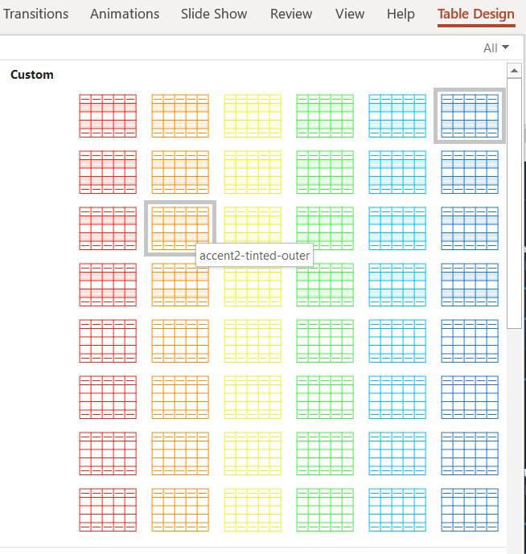

# powerpoint-custom-table-style-generator

Allows you to create custom style file for your PowerPoint tables. It will generate custom styles for all your accent colors the same way PowerPoint creates its default styles. For instance:

 

## Installation

You need to install [gomplate](https://docs.gomplate.ca/installing/). You also need `realpath` to be available.

On MacOS you can install those using [brew](https://brew.sh/):
````
brew install coreutils
brew install gomplate
````

## Execution

In a Terminal run `./render.sh` to get help on available options.

You can use the default template and example file to test the various options:
````
./render.sh -x example.pptx -i 2 -o 5 -a 35 template.xml
````

Do not forget to close and reopen `example.pptx` file in PowerPoint to see the results.

To copy the result to your clipboard (for use with [OOXML Tools extension](https://chrome.google.com/webstore/detail/ooxml-tools/bjmmjfdegplhkefakjkccocjanekbapn?hl=en) for instance), use the `-x copy` option.

## Customizing the template

You can of course customize the template to your needs. You will need to:
- get PowerPoint XML knowledge (see next section)
- get [gomplate syntax](https://docs.gomplate.ca/syntax/) knowledge

And do not hesitate to share your templates through a PR!

## Background information

Everything about creating custom table styles by hacking the PowerPoint XML can be found on John Korchok site:

- [XML Hacking: An Introduction](http://www.brandwares.com/bestpractices/2015/02/xml-hacking-an-introduction/)
- [XML Hacking: Editing in OS X](http://www.brandwares.com/bestpractices/2015/11/xml-hacking-editing-in-os-x/)
- [Part 1: Custom Table Styles](http://www.brandwares.com/bestpractices/2015/07/xml-hacking-custom-table-styles/)
- [Part 2: Table Styles Complete](http://www.brandwares.com/bestpractices/2015/08/xml-hacking-table-styles-complete/)
- [Part 3: Setting the table default text](http://www.brandwares.com/bestpractices/2015/03/xml-hacking-default-table-text/)
